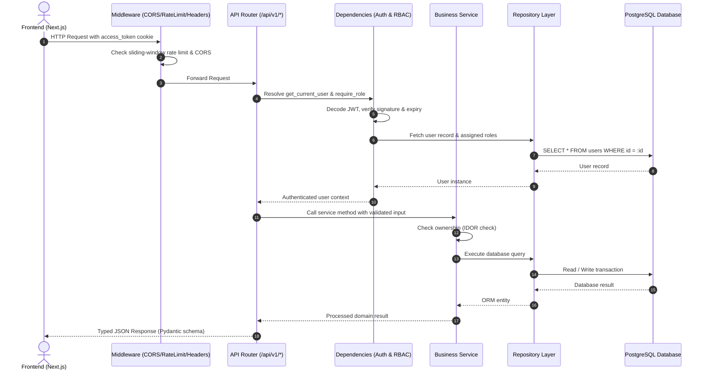

# Request Lifecycle — PromptFence

## Sequence of Execution for Authenticated API Calls

```mermaid
sequenceDiagram
    autonumber
    actor Client as Frontend (Next.js)
    participant MW as Middleware (CORS/RateLimit/Headers)
    participant Router as API Router (/api/v1/*)
    participant Dep as Dependencies (Auth & RBAC)
    participant Service as Business Service
    participant Repo as Repository Layer
    participant DB as PostgreSQL Database

    Client->>MW: HTTP Request with access_token cookie
    MW->>MW: Check sliding-window rate limit & CORS
    MW->>Router: Forward Request
    Router->>Dep: Resolve get_current_user & require_role
    Dep->>Dep: Decode JWT, verify signature & expiry
    Dep->>Repo: Fetch user record & assigned roles
    Repo->>DB: SELECT * FROM users WHERE id = :id
    DB-->>Repo: User record
    Repo-->>Dep: User instance
    Dep-->>Router: Authenticated user context
    Router->>Service: Call service method with validated input
    Service->>Service: Check ownership (IDOR check)
    Service->>Repo: Execute database query
    Repo->>DB: Read / Write transaction
    DB-->>Repo: Database result
    Repo-->>Service: ORM entity
    Service-->>Router: Processed domain result
    Router-->>Client: Typed JSON Response (Pydantic schema)
```

